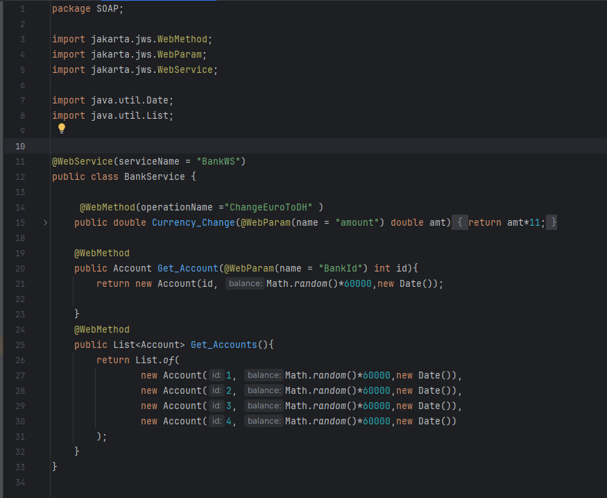

# Bank Web Service Project

This project demonstrates a SOAP-based web service for banking operations, developed using JAX-WS. The service offers functionalities such as currency conversion and account management. Testing is conducted using SoapUI, and a client application is implemented to interact with the service.

## Table of Contents

1. [Introduction](#introduction)
2. [Project Structure](#project-structure)
3. [Web Service Implementation](#web-service-implementation)
   - [Currency Conversion Operation](#currency-conversion-operation)
   - [Account Retrieval Operations](#account-retrieval-operations)
4. [Testing with SoapUI](#testing-with-soapui)
5. [Client Application](#client-application)

## Introduction

The Bank Web Service project illustrates the development of a SOAP web service using JAX-WS. It provides operations for currency conversion and account management, tested with SoapUI, and includes a client application for service consumption.

## Project Structure

## Web Service Implementation

The `BankService` class defines the web service with the following operations:

### Currency Conversion Operation

The `Currency_Change` method converts an amount in Euros to Moroccan Dirhams (DH) using a fixed exchange rate.

### Account Retrieval Operations

- **`Get_Account`**: Fetches account details corresponding to a specified Bank ID.
- **`Get_Accounts`**: Retrieves a comprehensive list of all accounts.

## Testing with SoapUI

### Test `The Currency_Change` method

### Test `Get_Account` method

### Test `Get_Accounts` method

## Client Application

